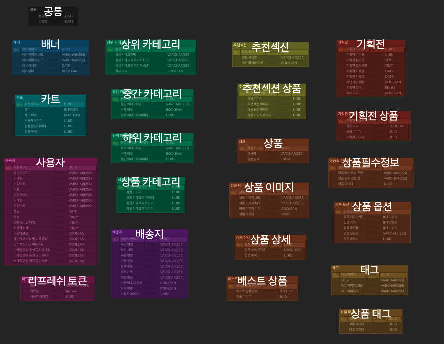

# 📢 **Project Overview**

이 프로젝트는 신세계 I&C가 주관한 **스파로스 아카데미**에서 진행된 스타벅스 온라인 스토어 **클론 코딩 프로젝트**입니다.

# 📢 **Starvive.store 보러가기**

🌐 [배포 링크](https://starvive.store)

# 🛠️ **Tech Stacks**

**Frontend**

**Backend**

**Infra**

**협업**

# 📢 **서비스 아키텍처**

# 📢 **CI/CD 아키텍처**

# 📢 **ERD**

# 📅 **프로젝트 기간**

전체 프로젝트 기간 : 2024-03-11 ~ 2024-04-23

# **팀원 소개**

| Name   | Position        | GitHub                                      |
| ------ | --------------- | ------------------------------------------- |
| 김동희 | Leader Frontend | [bababu1](https://github.com/bababu1)       |
| 박자겸 | Frontend        | [pjg3335](https://github.com/pjg3335)       |
| 김보미 | BackEnd         | [kbm8527](https://github.com/kbm8527)       |
| 신효철 | Infra BackEnd   | [HCSHIN123](https://github.com/HCSHIN123)   |
| 최지호 | BackEnd         | [jijihorang](https://github.com/jijihorang) |
